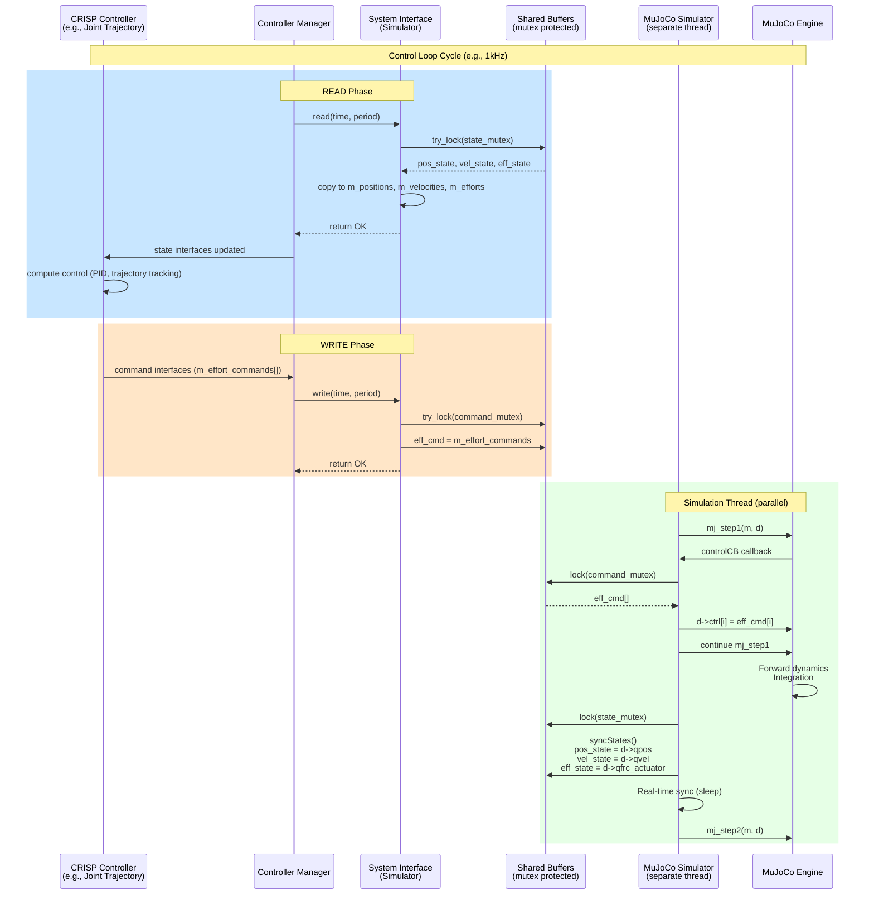
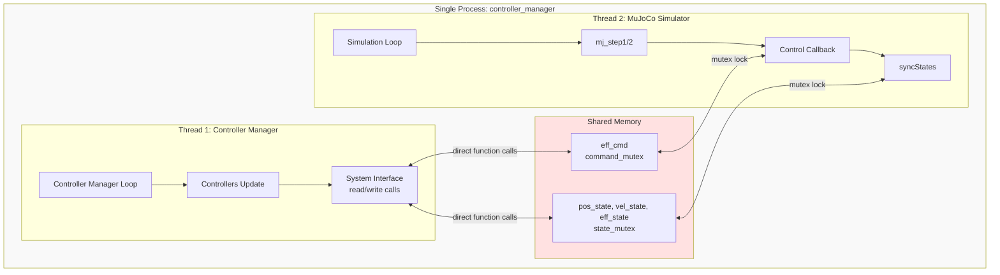
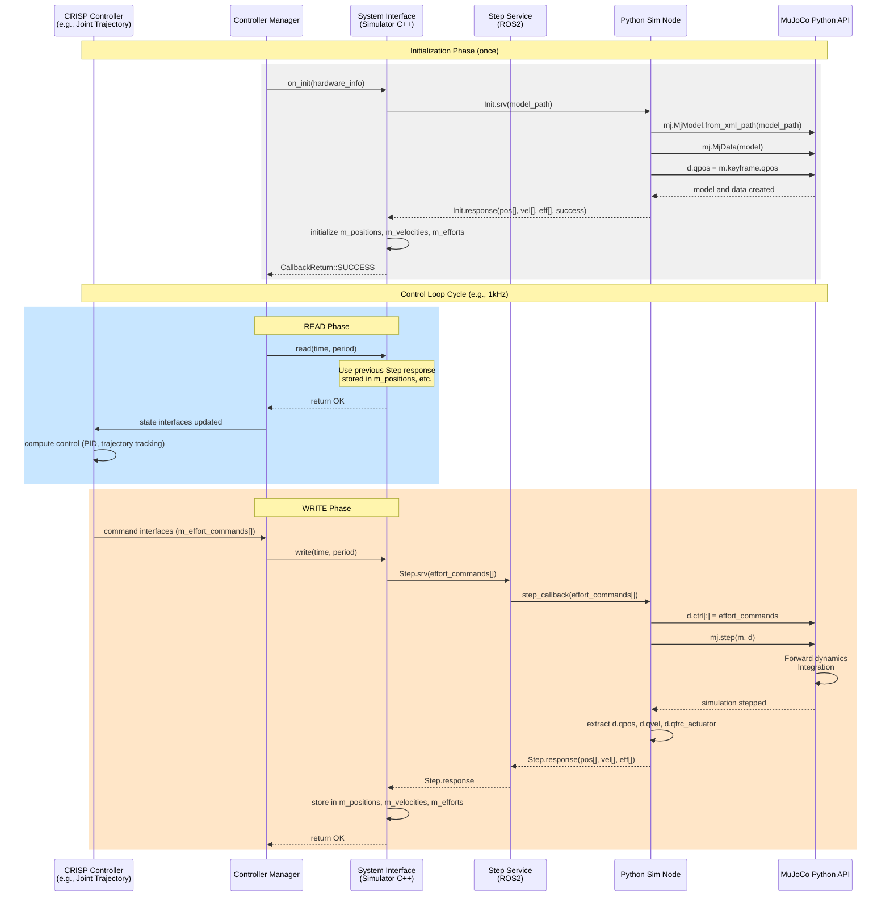
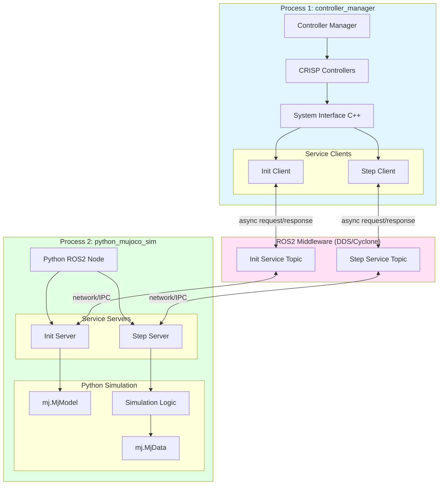

# CRISP Controllers ↔ crisp_mujoco_sim Data Exchange Architecture

This document shows the information/data exchange between CRISP controllers and the crisp_mujoco_sim package, comparing the current C++ in-process architecture with the proposed Python service-based architecture.

---

## Table of Contents
1. [Current Architecture: C++ In-Process](#current-architecture-c-in-process)
2. [Proposed Architecture: Python Service-Based](#proposed-architecture-python-service-based)
3. [Data Exchange Summary](#data-exchange-summary)
4. [Migration Path](#migration-path)

---

## Current Architecture: C++ In-Process

### High-Level System Overview

```mermaid
flowchart TB
    subgraph ROS2_CONTROL["ROS2 Control Framework"]
        CM[Controller Manager]
        
        subgraph CONTROLLERS["CRISP Controllers"]
            JTC[Joint Trajectory Controller]
            FC[Force Controller]
            GC[Gravity Compensation]
        end
        
        subgraph BROADCASTERS["State Broadcasters"]
            JSB[Joint State Broadcaster]
            RB[Robot Broadcaster]
        end
    end
    
    subgraph HW_INTERFACE["Hardware Interface Layer (crisp_mujoco_sim)"]
        SI[System Interface<br/>Simulator class]
        
        subgraph INTERFACES["Exported Interfaces"]
            CMD[Command Interfaces<br/>effort[0..n]]
            STATE[State Interfaces<br/>position[0..n]<br/>velocity[0..n]<br/>effort[0..n]]
        end
    end
    
    subgraph SIM_LAYER["Simulation Layer (same process)"]
        MJS[MuJoCoSimulator<br/>Singleton]
        
        subgraph BUFFERS["Shared Memory Buffers"]
            ECMD[eff_cmd<br/>mutex protected]
            PSTATE[pos_state<br/>vel_state<br/>eff_state<br/>mutex protected]
        end
        
        MJ[MuJoCo Physics Engine<br/>C++ API]
    end
    
    %% Controller to Interface connections
    CONTROLLERS -->|write commands| CMD
    STATE -->|read states| CONTROLLERS
    STATE -->|read states| BROADCASTERS
    
    %% Interface to buffers
    SI -->|write cycle| ECMD
    PSTATE -->|read cycle| SI
    
    %% Buffers to simulator
    ECMD -->|control callback| MJ
    MJ -->|sync states| PSTATE
    
    MJS -.manages.-> BUFFERS
    MJS -.runs.-> MJ
    
    CM -.orchestrates.-> CONTROLLERS
    CM -.orchestrates.-> BROADCASTERS
    CM -.read/write cycle.-> SI
    
    style ROS2_CONTROL fill:#e1f5ff
    style HW_INTERFACE fill:#fff4e1
    style SIM_LAYER fill:#f0f0f0
    style BUFFERS fill:#ffe1e1
```

### Detailed Data Flow (C++ In-Process)



### Thread Architecture (C++ In-Process)



---

## Proposed Architecture: Python Service-Based

### High-Level System Overview

```mermaid
flowchart TB
    subgraph ROS2_CONTROL["ROS2 Control Framework"]
        CM[Controller Manager]
        
        subgraph CONTROLLERS["CRISP Controllers"]
            JTC[Joint Trajectory Controller]
            FC[Force Controller]
            GC[Gravity Compensation]
        end
        
        subgraph BROADCASTERS["State Broadcasters"]
            JSB[Joint State Broadcaster]
            RB[Robot Broadcaster]
        end
    end
    
    subgraph HW_INTERFACE["Hardware Interface Layer (crisp_mujoco_sim)"]
        SI[System Interface<br/>Simulator class<br/>C++]
        
        subgraph INTERFACES["Exported Interfaces"]
            CMD[Command Interfaces<br/>effort[0..n]]
            STATE[State Interfaces<br/>position[0..n]<br/>velocity[0..n]<br/>effort[0..n]]
        end
        
        subgraph CLIENTS["ROS2 Service Clients"]
            INIT_CLI[Init Service Client]
            STEP_CLI[Step Service Client]
        end
    end
    
    subgraph ROS2_COMM["ROS2 Communication Layer"]
        INIT_SRV[Init Service]
        STEP_SRV[Step Service]
    end
    
    subgraph PY_SIM["Python Simulation Node (separate process)"]
        PY_NODE[Python ROS2 Node]
        
        subgraph PY_HANDLERS["Service Handlers"]
            INIT_HAND[init_callback]
            STEP_HAND[step_callback]
        end
        
        MJ_PY[MuJoCo Python API<br/>mujoco.MjModel<br/>mujoco.MjData]
    end
    
    %% Controller to Interface connections
    CONTROLLERS -->|write commands| CMD
    STATE -->|read states| CONTROLLERS
    STATE -->|read states| BROADCASTERS
    
    %% System Interface to ROS2 services
    SI -->|on_init: async call| INIT_CLI
    SI -->|write: async call| STEP_CLI
    INIT_CLI -->|Init.srv| INIT_SRV
    STEP_CLI -->|Step.srv| STEP_SRV
    
    %% ROS2 to Python
    INIT_SRV -->|model_path| INIT_HAND
    STEP_SRV -->|effort_commands[]| STEP_HAND
    INIT_HAND -->|pos, vel, eff| INIT_SRV
    STEP_HAND -->|pos, vel, eff| STEP_SRV
    
    %% Python handlers to MuJoCo
    INIT_HAND -->|mj.load_model| MJ_PY
    STEP_HAND -->|d.ctrl = efforts<br/>mj.step(m, d)| MJ_PY
    MJ_PY -->|d.qpos, d.qvel| STEP_HAND
    
    PY_NODE -.manages.-> PY_HANDLERS
    
    CM -.orchestrates.-> CONTROLLERS
    CM -.orchestrates.-> BROADCASTERS
    CM -.read/write cycle.-> SI
    
    style ROS2_CONTROL fill:#e1f5ff
    style HW_INTERFACE fill:#fff4e1
    style PY_SIM fill:#e1ffe1
    style ROS2_COMM fill:#ffe1f5
```

### Detailed Data Flow (Python Service-Based)



### Process Architecture (Python Service-Based)



---

## Data Exchange Summary

### Data Types Exchanged

| Direction | Data Type | Size | Description | Current Method | Proposed Method |
|-----------|-----------|------|-------------|----------------|-----------------|
| Controller → Simulator | `effort_commands[]` | n × float64 | Joint torque commands | Mutex-protected buffer | ROS2 Step.srv request |
| Simulator → Controller | `position[]` | n × float64 | Joint positions (qpos) | Mutex-protected buffer | ROS2 Step.srv response |
| Simulator → Controller | `velocity[]` | n × float64 | Joint velocities (qvel) | Mutex-protected buffer | ROS2 Step.srv response |
| Simulator → Controller | `effort[]` | n × float64 | Joint efforts (qfrc_actuator) | Mutex-protected buffer | ROS2 Step.srv response |
| Controller → Simulator | `model_path` | string | Path to MuJoCo XML (init only) | Hardware parameter | ROS2 Init.srv request |

Where `n` = number of actuated joints (e.g., 7 for Franka FR3)

### Communication Patterns

#### Current (C++ In-Process)
- **Type**: Direct memory access via mutex-protected buffers
- **Latency**: < 1 microsecond (in-process)
- **Synchronization**: Mutexes + `try_lock()` for non-blocking
- **Threading**: Two threads in same process
- **Coupling**: Tight - crash in simulator crashes entire system
- **Language**: C++ only

#### Proposed (Python Service-Based)
- **Type**: ROS2 service calls (async request/response)
- **Latency**: ~100-500 microseconds (IPC, depends on DDS)
- **Synchronization**: ROS2 executor handles service dispatch
- **Threading**: Separate processes
- **Coupling**: Loose - processes isolated, can restart independently
- **Language**: C++ System Interface, Python simulator

### Service Definitions

#### Init.srv
```
# Request
string model_path

---
# Response
float64[] position
float64[] velocity
float64[] effort
bool success
```

#### Step.srv
```
# Request
float64[] effort_commands

---
# Response
float64[] position
float64[] velocity
float64[] effort
```

---

## Migration Path

### Phase 1: Preparation
1. ✅ Service message definitions exist (`Init.srv`, `Step.srv`)
2. ✅ Service clients declared in `system_interface.h`
3. ⚠️ Service clients not initialized in `system_interface.cpp`
4. ⚠️ Currently using direct singleton access

### Phase 2: Modify System Interface (C++)
```cpp
// In Simulator::on_init()
// Replace:
// m_simulation = std::thread(MuJoCoSimulator::simulate, m_mujoco_model);

// With:
m_node = std::make_shared<rclcpp::Node>("mujoco_sim_client");
m_init_client = m_node->create_client<crisp_mujoco_sim_msgs::srv::Init>("mujoco_init");
m_step_client = m_node->create_client<crisp_mujoco_sim_msgs::srv::Step>("mujoco_step");
m_executor = std::make_shared<rclcpp::executors::SingleThreadedExecutor>();
m_executor->add_node(m_node);

// Call Init service
auto init_request = std::make_shared<crisp_mujoco_sim_msgs::srv::Init::Request>();
init_request->model_path = m_mujoco_model;
auto init_future = m_init_client->async_send_request(init_request);
// Wait and process response...
```

```cpp
// In Simulator::write()
// Replace:
// MuJoCoSimulator::getInstance().write(m_effort_commands);

// With:
auto step_request = std::make_shared<crisp_mujoco_sim_msgs::srv::Step::Request>();
step_request->effort_commands = m_effort_commands;
auto step_future = m_step_client->async_send_request(step_request);
// Wait and process response, store in m_positions, m_velocities, m_efforts
```

### Phase 3: Create Python Simulator Node
```python
import rclpy
from rclpy.node import Node
import mujoco
from crisp_mujoco_sim_msgs.srv import Init, Step

class MuJoCoSimulatorNode(Node):
    def __init__(self):
        super().__init__('mujoco_simulator')
        
        self.init_srv = self.create_service(Init, 'mujoco_init', self.init_callback)
        self.step_srv = self.create_service(Step, 'mujoco_step', self.step_callback)
        
        self.model = None
        self.data = None
    
    def init_callback(self, request, response):
        self.model = mujoco.MjModel.from_xml_path(request.model_path)
        self.data = mujoco.MjData(self.model)
        # Set initial state from keyframe
        self.data.qpos[:] = self.model.keyframe(0).qpos
        
        response.position = self.data.qpos[:self.model.nu].tolist()
        response.velocity = self.data.qvel[:self.model.nu].tolist()
        response.effort = self.data.qfrc_actuator[:self.model.nu].tolist()
        response.success = True
        return response
    
    def step_callback(self, request, response):
        # Apply effort commands
        self.data.ctrl[:] = request.effort_commands
        
        # Step simulation
        mujoco.mj_step(self.model, self.data)
        
        # Return state
        response.position = self.data.qpos[:self.model.nu].tolist()
        response.velocity = self.data.qvel[:self.model.nu].tolist()
        response.effort = self.data.qfrc_actuator[:self.model.nu].tolist()
        return response
```

### Phase 4: Launch Configuration
```python
# In launch file
simulator_node = Node(
    package='crisp_mujoco_sim',
    executable='python_mujoco_sim',
    name='mujoco_simulator',
    output='screen'
)

controller_manager_node = Node(
    package='controller_manager',
    executable='ros2_control_node',
    parameters=[robot_description, controller_config],
    # System Interface will connect to simulator via services
)
```

### Benefits of Migration
✅ **Language Flexibility**: Use Python MuJoCo API (often easier, better documented)  
✅ **Process Isolation**: Simulator crash doesn't kill controller manager  
✅ **Easier Debugging**: Can restart simulator independently  
✅ **Better Python Ecosystem**: Access to Python ML/visualization libraries  
✅ **Maintainability**: Cleaner separation of concerns  
⚠️ **Slight Performance Trade-off**: ~100-500μs added latency (usually acceptable for robot control)

---

## Key Differences Comparison

| Aspect | C++ In-Process | Python Service-Based |
|--------|----------------|----------------------|
| **Processes** | 1 (controller_manager) | 2 (controller_manager + python_sim) |
| **Communication** | Shared memory + mutex | ROS2 services (IPC/network) |
| **Latency** | < 1 μs | ~100-500 μs |
| **Robustness** | Tight coupling | Loose coupling |
| **Language** | C++ only | C++ interface + Python sim |
| **Debugging** | Harder (threads) | Easier (separate processes) |
| **MuJoCo API** | C API (mujoco.h) | Python API (more pythonic) |
| **Crash Behavior** | Total system crash | Isolated crash |
| **Setup Complexity** | Lower (single binary) | Higher (two nodes) |
| **Code Already Present** | ✅ Full implementation | ⚠️ Service clients declared but unused |

---

## Conclusion

Both architectures exchange the **same data** (effort commands, joint states), but differ in **how** that data is transferred:

- **Current**: High-performance in-process shared memory with mutex synchronization
- **Proposed**: Process-isolated ROS2 service-based communication with better modularity

The service-based approach (Approach 1) is **recommended** because:
1. Service definitions already exist
2. Provides clean process separation
3. Enables Python MuJoCo usage
4. Latency overhead is acceptable for most robotic applications (< 1ms)
5. Easier to debug and maintain

The System Interface layer can be **kept mostly unchanged** - only the communication mechanism needs updating from direct function calls to ROS2 service calls.
