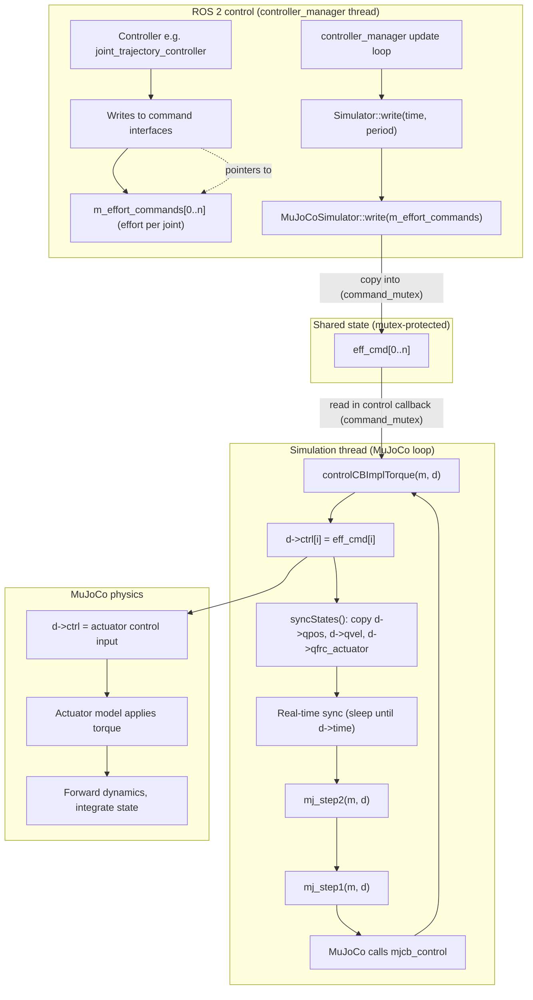

# Joint Effort Command Flow: ROS 2 → MuJoCo

This document describes how a joint effort (torque) command received by the ROS 2 package is forwarded into MuJoCo and used in the simulation. **The package does not compute the effort**—that is done by ROS 2 controllers (e.g. `joint_trajectory_controller` with a PID). This package only **copies** the commanded effort from ROS 2 into MuJoCo’s actuator control array `d->ctrl`.

---

## Flow diagram



---

## Step-by-step flow

| Step | Where | What happens |
|------|--------|----------------|
| 1 | ROS 2 controller | A controller (e.g. `joint_trajectory_controller`) computes effort from trajectory/error and **writes** to the command interfaces. Those interfaces are backed by `m_effort_commands[i]` in `Simulator`. |
| 2 | controller_manager | Each control cycle it calls `read()` then `write()` on the hardware interface. |
| 3 | `Simulator::write()` | Called with current time and period. Calls `MuJoCoSimulator::getInstance().write(m_effort_commands)`. |
| 4 | `MuJoCoSimulator::write()` | Locks `command_mutex`, copies the given effort vector into `eff_cmd`, unlocks. So **effort command is stored** in the singleton’s buffer. |
| 5 | Sim thread loop | Runs in a **separate thread** (started in `Simulator::on_init()`). Each iteration: `mj_step1` → (MuJoCo calls callback) → `syncStates()` → real-time sync → `mj_step2`. |
| 6 | `mj_step1(m, d)` | MuJoCo runs the first part of the step. **During this**, it invokes the global control callback `mjcb_control`, which is set to `MuJoCoSimulator::controlCB`. |
| 7 | `controlCB` → `controlCBImplTorque` | Locks `command_mutex`, copies `eff_cmd[i]` → `d->ctrl[i]` for each actuator, unlocks. So **ROS 2 effort command becomes MuJoCo’s control input**. |
| 8 | MuJoCo physics | Uses `d->ctrl` as the actuator control (for torque actuators, this is the torque). Applies forces, runs forward dynamics, integrates to get new `d->qpos`, `d->qvel`, etc. |
| 9 | `syncStates()` | After the step, copies `d->qpos`, `d->qvel`, `d->qfrc_actuator` into `pos_state`, `vel_state`, `eff_state` for the ROS 2 side. |
| 10 | `Simulator::read()` | When controller_manager calls `read()`, it copies those buffers into `m_positions`, `m_velocities`, `m_efforts`, which back the **state interfaces** used by controllers and `joint_state_broadcaster`. |

---

## Data flow (simplified)

```
Controller (PID/trajectory)
    → command interface (m_effort_commands)
        → Simulator::write()
            → MuJoCoSimulator::write()  →  eff_cmd
                → [sim thread] controlCB  →  d->ctrl
                    → MuJoCo actuator model  →  new qpos, qvel
                        → syncStates()  →  pos_state, vel_state, eff_state
                            → Simulator::read()  →  state interfaces (m_positions, etc.)
```

---

## Important points

- **No effort computation here**: Effort is computed by the ROS 2 controller. This package only **forwards** it into MuJoCo’s `d->ctrl`.
- **Two threads**: The controller_manager thread calls `read()`/`write()`; the sim thread runs the MuJoCo loop. `eff_cmd` and state buffers are shared and protected by `command_mutex` and `state_mutex`.
- **Torque control**: For actuators defined as torque-controlled in the MuJoCo model, `d->ctrl[i]` is the torque applied to the corresponding joint; MuJoCo uses it directly in the dynamics.
